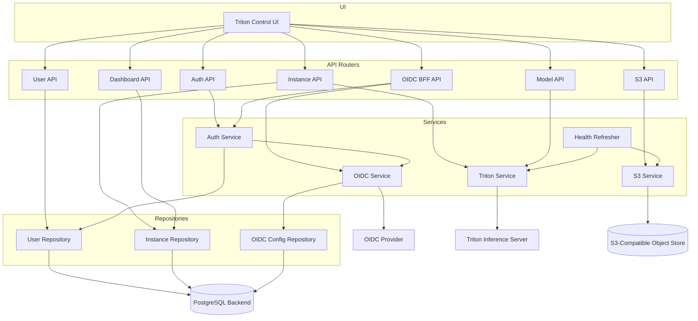

# Backend Components

This page describes the main backend building blocks of Triton Control and how
requests move from the UI through API routers, services, repositories, and
PostgreSQL. 

The backend is based on a layered architecture. API routers handle HTTP
requests and response translation, services contain business logic and external
system interactions, repositories isolate database access, and schemas define
the request and response contracts used between these layers.

## Backend Component View (C4 Level 3)

## Router Responsibilities

- Auth API: login, register, logout, token refresh, local auth.
- OIDC BFF API: authorization code + PKCE flow and server-side token handling.
- Instance API: Triton instance CRUD and health status.
- Model API: model repository index and load/unload actions.
- S3 API: browse/read/write model artifacts in S3-compatible storage.
- User API: user lifecycle, roles, instance assignment.
- Dashboard API: fleet health aggregation.

## Service Responsibilities

- Auth Service: password hashing and JWT/session handling.
- OIDC Service: provider discovery, token exchange, userinfo.
- Triton Service: async client for Triton REST endpoints.
- S3 Service: per-instance S3-compatible object store access.
- Health Refresher: scheduled health and storage connectivity checks.

## Persistence

- User Repository, Instance Repository, and OIDC Config Repository persist to
  PostgreSQL via SQLModel-based data access.
