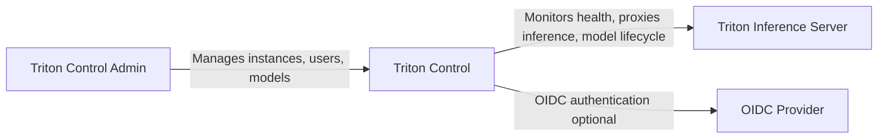
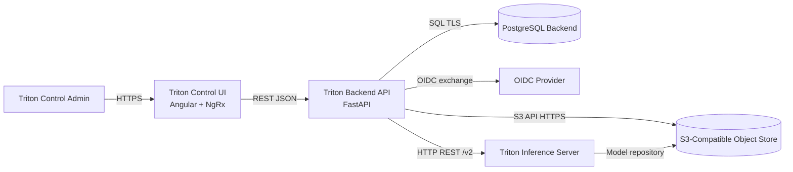

# Architecture Overview

## Scope

Triton Control is a management platform for NVIDIA Triton Inference Server
instances. It includes a browser-based UI, a FastAPI backend, persistence,
optional OIDC identity integration, and S3-compatible model storage.

## System Context (C4 Level 1)

## Containers (C4 Level 2)

## Runtime Responsibilities

- Triton Control UI: user workflows for instances, users, models, and S3 browsing.
- Backend API: auth (local + OIDC BFF), Triton proxy APIs, health polling,
  and storage operations.
- PostgreSQL: users, roles, instance config, OIDC settings, and health state.
- S3-compatible object store: model repository files consumed by Triton and
  managed via backend.
- OIDC provider: optional external identity provider.
