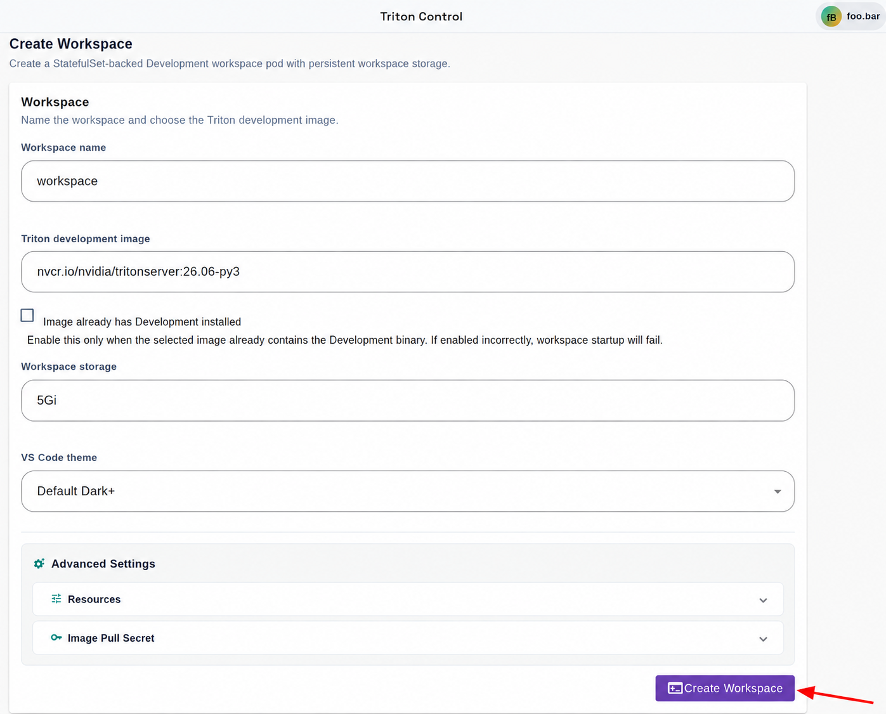

# scikit-learn Iris Training Workflow

This example follows a small data-science loop in Triton Control: develop a
training script in a Development workspace, upload it to S3-compatible object
storage, then run it as an Argo Workflow. The workflow downloads the script,
trains an Iris classifier, and stores the model and evaluation results back in
the object store.


## Prerequisites

- Argo Workflows is enabled in Triton Control.
- You have an existing S3-compatible bucket and credentials that can read the
  uploaded training script and write below the selected output prefix.


## 1. Create a Development Workspace

In Triton Control, open **Development** and create a CPU-only workspace for
writing and testing the training code:

| Field | Value |
| --- | --- |
| Triton development image | `nvcr.io/nvidia/tritonserver:26.06-py3` |
| Image already has Development installed | Disabled |
| Workspace storage | At least `5Gi` |
| GPU count | `0` |

When the workspace is ready, open code-server from **Development**. Triton
Control installs the Development runtime because the Python image does not
include code-server.



## 2. Create the Training Code in the Workspace

In the workspace, create a directory for the example: `/workspace/sklearn-iris-training`

Then copy or upload `train_iris.py` and `workflow.yaml` from this example into
that directory. `train_iris.py` is the training code that the workflow will execute. It trains
a `StandardScaler` plus `LogisticRegression` pipeline on
`sklearn.datasets.load_iris` and writes the training results to its output
directory.


Edit the script in the workspace to try a different model, feature processing,
or training arguments. Keep the output files, or update the validation and
artifact expectations in `workflow.yaml` to match your own script.

## 3. Install, Configure, and Use an S3 Client

The workspace needs an S3 client to upload the training script. You can install
and configure the optional [S3/R2 Explorer](../../../docs/development-workspaces.md#optional-install-s3r2-explorer)
extension, or use the AWS CLI from the code-server terminal.

For the AWS CLI path, run:

```bash
python -m pip install --user awscli
aws configure --profile workflow-training
```

At the prompts, enter the access key ID, secret access key, bucket region, and
your preferred output format. For an S3-compatible provider such as Cloudflare
R2, use that provider's S3 API credentials; the endpoint is supplied when you
upload. Do not put these credential values in `workflow.yaml`.

From the example directory in the workspace, upload the script. Replace the
endpoint and bucket with your own values. In the command,
`https://<your-s3-endpoint>` is the S3 API endpoint;
`s3://<your-s3-bucket>/...` is the destination made of the bucket name and
object key.

```bash
cd /workspace/sklearn-iris-training
aws --profile workflow-training \
  --endpoint-url https://<your-s3-endpoint> \
  s3 cp train_iris.py \
  s3://<your-s3-bucket>/workflows/sklearn-iris-training/train_iris.py
```

## 4. Configure the Workflow S3 Secret

In Triton Control, open **Workflows**, select **Configure S3 Secrets**, and add
the access key ID and secret access key that can read the script and write the
workflow outputs. Triton Control creates an Kubernetes Secret.

Copy the generated **Secret** name shown in the credentials dialog. The
workflow uses only this name; it never contains the credential values. The
generated Secret has the keys expected by this example:

```text
access-key-id
secret-access-key
```

## 5. Configure the Workflow in the Workspace

Back in code-server, open `/workspace/sklearn-iris-training/workflow.yaml` and
update the parameters under `spec.arguments.parameters`:

| Parameter | Example | Meaning |
| --- | --- | --- |
| `s3-endpoint` | `s3.example.com` | S3 API host, optionally with a port; omit `https://` |
| `s3-region` | `us-east-1` | Bucket region |
| `s3-bucket` | `triton-artifacts` | Existing bucket name |
| `s3-credentials-secret` | `workflow-s3-training-a1b2c3` | Secret name from **Configure S3 Secrets** |
| `s3-script-key` | `workflows/sklearn-iris-training/train_iris.py` | Object uploaded in step 3 |
| `s3-output-prefix` | `workflows/sklearn-iris-training/runs` | Parent prefix for run outputs |


For an intentionally plain-HTTP development endpoint, add `insecure: true` to
both `s3` blocks. Do not use that setting for an HTTPS endpoint.

## 6. Submit the Workflow

In Argo Workflows:

1. Select **Submit New Workflow**.
2. Select **Edit using full workflow options**.
3. Paste the configured contents of `workflow.yaml`.
4. Create the workflow.


Before the training container starts, the Argo executor downloads
`s3-script-key` to `/tmp/train_iris.py`. The container installs the pinned
Python packages and writes all training results to `/tmp/outputs`. After the
container exits, the executor uploads that directory to S3. A missing source
object, invalid credentials, or a failed upload makes the Workflow fail.

## 7. Check the Outputs

Each run gets its own prefix derived from the generated Workflow name:

```text
s3://triton-artifacts/workflows/sklearn-iris-training/runs/
`-- sklearn-iris-training-abc12/
    |-- accuracy.txt
    |-- iris-logreg-model.joblib
    |-- labels.txt
    `-- metrics.json
```

The Argo Workflow also exposes `accuracy` as an output parameter and records
the S3 location as the `training-results` output artifact.


