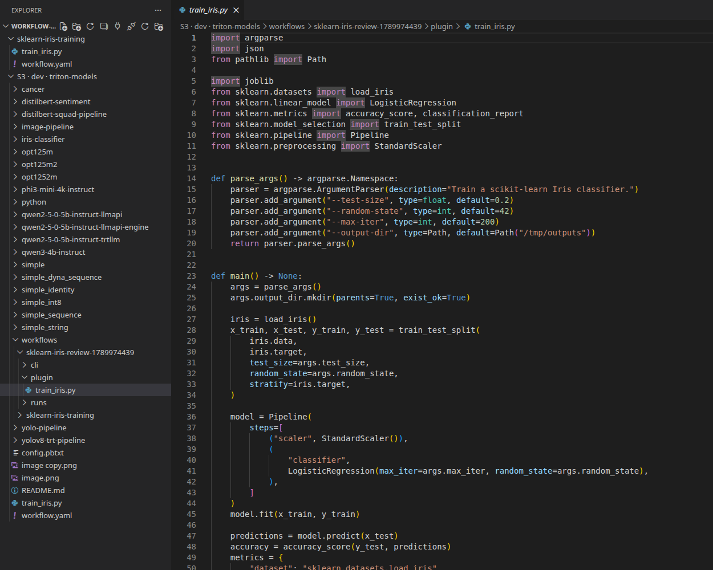
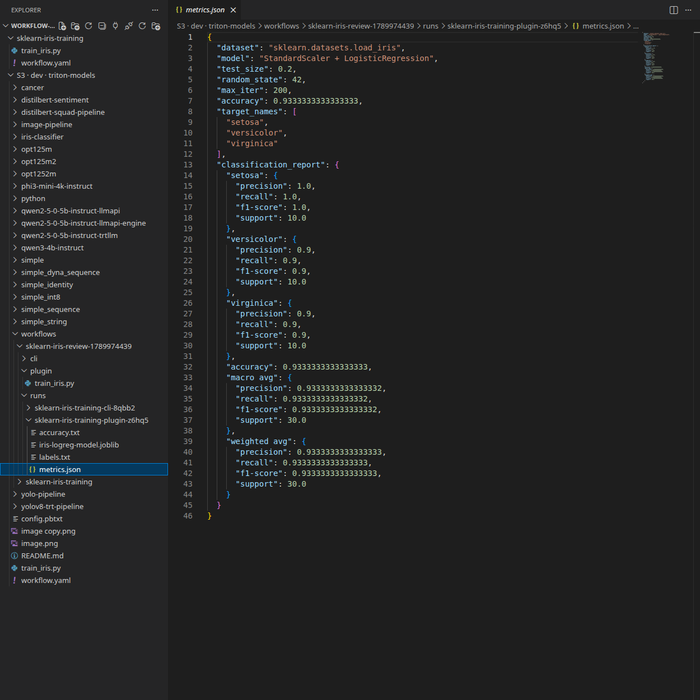

# scikit-learn Iris Training Workflow

This example follows a small data-science loop in Triton Control: develop a
training script in a Development workspace, upload it to S3-compatible object
storage, then run it as an Argo Workflow. The workflow downloads the script,
trains an Iris classifier, and stores the model and evaluation results back in
the object store.


## Prerequisites

- Argo Workflows is enabled in Triton Control.
- You have an existing S3-compatible bucket and a saved profile under the Triton
  Control account menu's **S3 Profiles**. Use the same account for the workspace
  and workflow profile link.
- The profile's credentials allow listing the bucket, reading the training script,
  and writing the script and run outputs. The endpoint must be reachable from
  both the workspace and workflow pods. For HTTPS with a custom CA, include the
  public CA certificate in the saved profile.


## 1. Create a Development Workspace

In Triton Control, open **Development** and create a CPU-only workspace for
writing and testing the training code:

| Field | Value |
| --- | --- |
| Triton development image | `nvcr.io/nvidia/tritonserver:26.06-py3` |
| Image already has Development installed | Disabled |
| Workspace storage | At least `5Gi` |
| GPU count | `0` |

When the workspace is ready, open code-server from **Development**. Triton
Control installs the Development runtime because the Python image does not
include code-server. It also installs the **Triton Control Deploy** plugin, whose
S3 browser appears alongside the workspace folders in **Explorer**.


## 2. Create the Training Code in the Workspace

In the workspace, create a directory for the example: `/workspace/sklearn-iris-training`

Then copy or upload `train_iris.py` and `workflow.yaml` from this example into
that directory. `train_iris.py` is the training code that the workflow will execute. It trains
a `StandardScaler` plus `LogisticRegression` pipeline on
`sklearn.datasets.load_iris` and writes the training results to its output
directory.


Edit the script in the workspace to try a different model, feature processing,
or training arguments. Keep the output files, or update the validation and
artifact expectations in `workflow.yaml` to match your own script.

## 3. Upload the Training Script

Choose either **AWS CLI** in the workspace terminal or the bundled
**code-server S3 plugin** in Explorer.

### AWS CLI

Install and configure AWS CLI in the workspace terminal:

```bash
python3 -m pip install --user awscli
aws configure --profile workflow-training
```

If the saved S3 profile uses path-style addressing, configure the CLI to match:

```bash
aws configure set s3.addressing_style path --profile workflow-training
```

For a provider requiring virtual-hosted addressing, use `virtual` instead of
`path`.

For HTTPS with a custom CA, save the public CA bundle to a workspace file and
configure AWS CLI in the terminal before uploading:

```bash
export AWS_CA_BUNDLE=/path/to/ca-bundle.pem
```

AWS CLI does not automatically load Triton Control S3 profiles.

At the prompts, enter the access key ID, secret access key, bucket region, and
your preferred output format. For an S3-compatible provider such as Cloudflare
R2, use that provider's S3 API credentials; the endpoint is supplied when you
upload. Do not put these credential values in `workflow.yaml`.

From the example directory in the workspace, upload the script. Replace the
endpoint and bucket with your own values. In the command,
`https://<your-s3-endpoint>` is the S3 API endpoint;
`s3://<your-s3-bucket>/...` is the destination made of the bucket name and
object key.

```bash
cd /workspace/sklearn-iris-training
aws --profile workflow-training \
  --endpoint-url https://<your-s3-endpoint> \
  s3 cp train_iris.py \
  s3://<your-s3-bucket>/workflows/sklearn-iris-training/train_iris.py
```

Use the endpoint and bucket from the Triton Control S3 profile you will link
in step 4. If you use its browsing prefix (for example, `team-a`), include it
explicitly in the upload destination:
`s3://<your-s3-bucket>/team-a/workflows/sklearn-iris-training/train_iris.py`.
Use that same full object key in `workflow.yaml`.

### Code-Server S3 Plugin

Use the bundled **Triton Control Deploy** plugin in code-server's **Explorer**.
It loads endpoint, bucket, credentials, addressing mode, and the optional CA
certificate dynamically from your saved Triton Control S3 profile.

1. In **Explorer**, right-click the workspace folder and choose
   **S3 Operations → Choose Profile…**, then select your saved profile.
   If already connected, use **S3 Operations → Switch Profile…** to select it.
2. Expand **S3 · <profile name> · <bucket>** beside the workspace folder.
3. Under that S3 root, create or open `workflows/sklearn-iris-training/` using
   Explorer's **New Folder** action.
4. Drag `/workspace/sklearn-iris-training/train_iris.py` from the workspace
   tree onto that S3 folder. Workspace-to-S3 dragging copies the file and leaves
   the workspace source in place.
5. Wait for the transfer to finish and confirm that `train_iris.py` appears in
   the destination folder. Open it from the S3 tree to check the uploaded code.

You can also right-click the workspace file and choose **S3 Operations → Copy**,
then right-click the destination S3 folder and choose **S3 Operations → Paste**.
To copy the entire `sklearn-iris-training` folder, drop it onto `workflows/`;
the plugin preserves the outer folder name.

With an empty profile prefix, the uploaded script is:

```text
s3://<your-s3-bucket>/workflows/sklearn-iris-training/train_iris.py
```

If the profile has a prefix such as `team-a`, Explorer's S3 root starts at that
prefix. The full script key is then
`team-a/workflows/sklearn-iris-training/train_iris.py`. Include that prefix in
both workflow object-path parameters in step 5.

Drag-and-drop follows these rules:

- Workspace ↔ S3, or between different S3 profiles: copy.
- Within the same S3 profile: move.
- **Ctrl-drag** forces copy (Option on macOS); **Shift-drag** forces move.

The screenshot below shows the uploaded script open from S3 beside the local
workspace. The validation run uses an isolated `sklearn-iris-review-…/plugin/`
folder; use the object key you configured for your own run.



Use **S3 Operations → Disconnect** to remove the S3 connection from Explorer.

## 4. Link the S3 Profile

In **Workflows → Configure S3 Secrets**, select the Triton Control S3 profile
for the endpoint and bucket used in step 3, then click **Link profile**. If you
used the code-server plugin, select the same profile. AWS CLI profiles are
configured separately and are not linked automatically.

Triton Control creates a Secret and an Argo repository ConfigMap in the workflow
namespace. Endpoint, bucket, region, credentials, and the optional
HTTPS CA certificate sync automatically when the profile is saved. The ConfigMap
stores connection settings; the Secret stores credentials and the CA certificate.

For an existing link, click **Sync now** once after upgrading to create its repository.
The dialog shows sync errors and lets the profile owner retry. Remove the link before
deleting its source profile. New runs use updated settings; running workflows may
retain previously loaded values.

## 5. Configure the Workflow in the Workspace

Open `/workspace/sklearn-iris-training/workflow.yaml`. Copy the
`artifactRepositoryRef` shown in the dialog under `spec`:

```yaml
artifactRepositoryRef:
  configMap: workflow-s3-training-a1b2c3 # Use your generated name.
  key: repository
```

Submit in the namespace shown in the dialog. When updating an older workflow, remove
`s3-endpoint`, `s3-region`, `s3-bucket`, and `s3-credentials-secret` from both parameter
lists. Replace each artifact's `s3` block with just its `key`; the linked repository
provides the connection settings, credential references, and `caSecret` automatically.
Argo uses [key-only artifacts](https://argo-workflows.readthedocs.io/en/latest/key-only-artifacts/)
with the linked repository. Set only the object paths in `spec.arguments.parameters`:

| Parameter | Example | Meaning |
| --- | --- | --- |
| `s3-script-key` | `workflows/sklearn-iris-training/train_iris.py` | Object uploaded in step 3 |
| `s3-output-prefix` | `workflows/sklearn-iris-training/runs` | Parent prefix for run outputs |

Object paths are full bucket keys; the profile's browsing prefix is not added.
For example, with the `team-a` prefix from step 3, set `s3-script-key` to
`team-a/workflows/sklearn-iris-training/train_iris.py` and `s3-output-prefix` to
`team-a/workflows/sklearn-iris-training/runs`.
For HTTPS with a custom CA, save the public CA certificate in the S3 profile;
Triton Control adds Argo's certificate reference automatically.

## 6. Submit the Workflow

In Argo Workflows:

1. Select **Submit New Workflow**.
2. Select **Edit using full workflow options**.
3. Paste the configured contents of `workflow.yaml`, or use **Upload File**
   to select the configured manifest from your computer.
4. Create the workflow.


The manifest screenshot uses the validation run's generated repository name
and isolated S3 keys. Copy your own `artifactRepositoryRef` and object keys as
explained in step 5.


Before the training container starts, the Argo executor downloads
`s3-script-key` to `/tmp/train_iris.py`. The container installs the pinned
Python packages and writes all training results to `/tmp/outputs`. After the
container exits, the executor uploads that directory to S3. A missing source
object, invalid credentials, or a failed upload makes the Workflow fail.

## 7. Check the Outputs

Outputs are stored at `s3://<bucketname>/<s3-output-prefix>/<workflow-name>/`.
`<bucketname>` comes from the linked S3 profile. With the default output prefix:

```text
s3://<bucketname>/workflows/sklearn-iris-training/runs/
`-- sklearn-iris-training-abc12/
    |-- accuracy.txt
    |-- iris-logreg-model.joblib
    |-- labels.txt
    `-- metrics.json
```

Use either method from step 3 to inspect the results.

### AWS CLI

Use the same profile, endpoint, and custom CA setting from step 3. Replace the
placeholders with your bucket, output prefix, and actual Argo Workflow name:

```bash
aws --profile workflow-training \
  --endpoint-url "https://<your-s3-endpoint>" \
  s3 ls "s3://<bucketname>/<s3-output-prefix>/<workflow-name>/" --recursive
```

Print the evaluation metrics:

```bash
aws --profile workflow-training \
  --endpoint-url "https://<your-s3-endpoint>" \
  s3 cp "s3://<bucketname>/<s3-output-prefix>/<workflow-name>/metrics.json" -
```

Include any browsing prefix in `<s3-output-prefix>`, just as you did in
`workflow.yaml`.

### Code-Server S3 Plugin

In code-server's **Explorer**, use **S3 Operations → Refresh** on the connected
S3 root to load the results written by Argo. Expand
`workflows/sklearn-iris-training/runs/<workflow-name>/` beneath the same profile
root used in step 3. This relative path also applies to the `team-a` example
when you included that prefix in both workflow parameters.

Check that all four files shown above exist. Open `metrics.json` and
`accuracy.txt` directly from the S3 tree to inspect the results. To keep a local
copy of the run, drag its folder from S3 onto `/workspace/sklearn-iris-training/`
in Explorer. The default S3-to-workspace drag copies the results and leaves
the S3 originals in place.



The Argo Workflow also exposes `accuracy` as an output parameter and records
the S3 location as the `training-results` output artifact.


