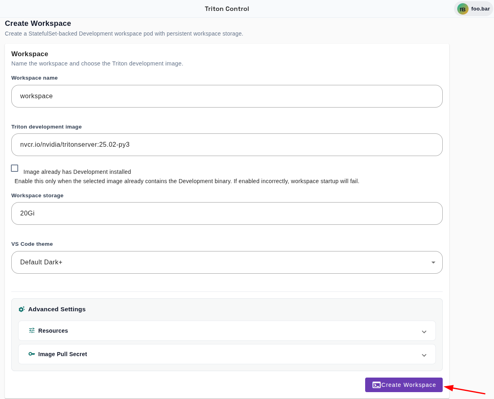
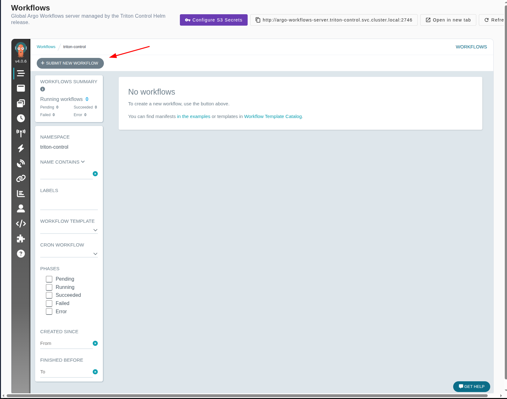
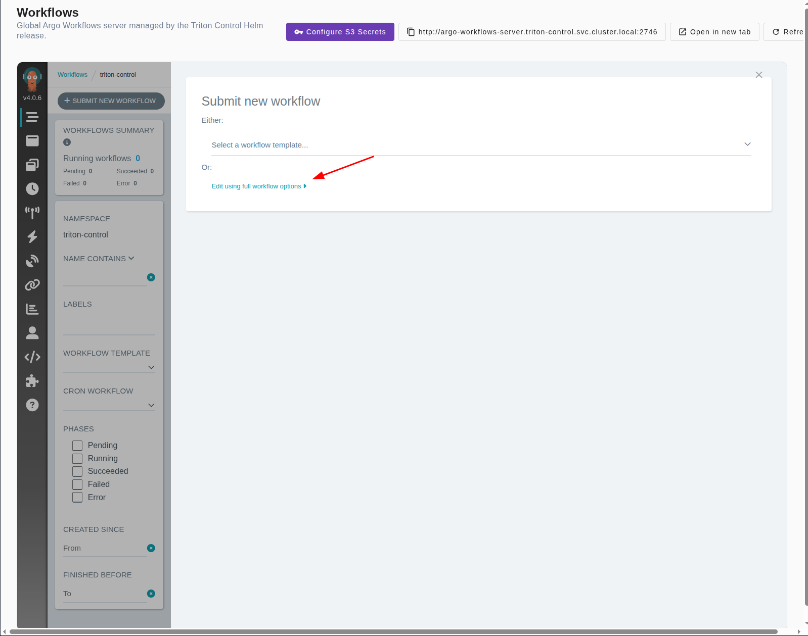
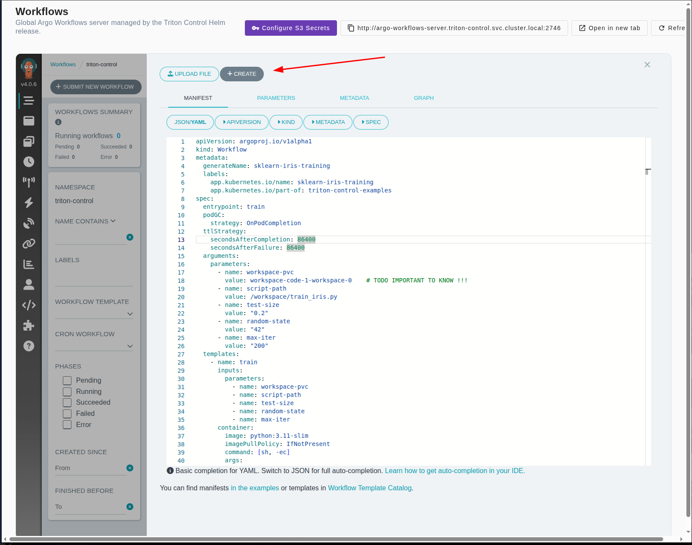
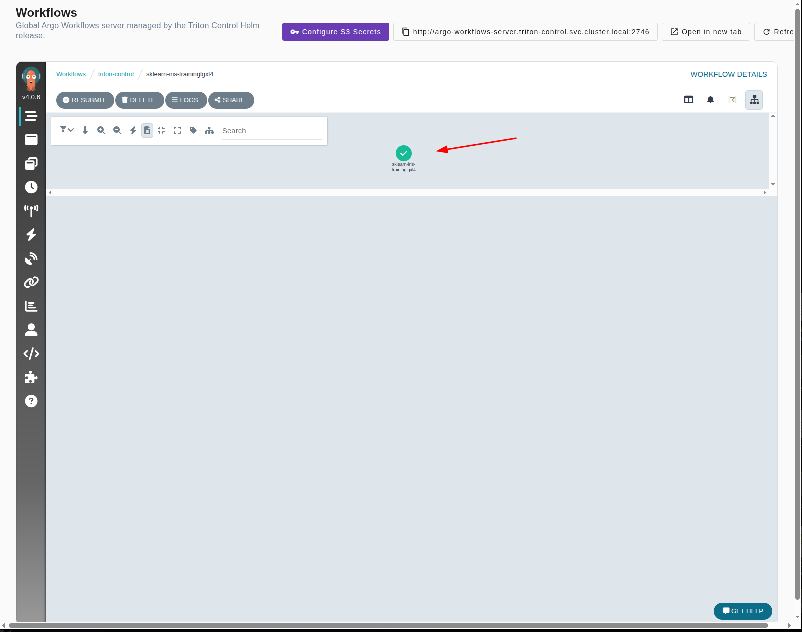

# scikit-learn Iris Training Workflow

Train a small scikit-learn Iris classifier from a Triton Control development
workspace by running the code through Argo Workflows.


## Files

| File | Use |
| --- | --- |
| `train_iris.py` | Training script run from the workspace PVC |
| `workflow.yaml` | Argo Workflow manifest that mounts the workspace PVC and runs the script |
| `screenshots/` | UI screenshots for the workspace and Argo Workflow submission |

## 1. Create Development Workspace

In Triton Control, open **Development** and create a workspace:

| Field | Value |
| --- | --- |
| Image | Any Python-capable image with shell access, for example `python:3.11-slim` or a project-specific data science image |
| Image already has Development installed | Depends on the image |
| Workspace storage | At least `1Gi` |
| GPU count | `0` |

When the workspace is ready, open code-server from **Development**.



## 2. Copy the Training Script

Copy `train_iris.py` into the workspace root:

```text
/workspace/train_iris.py
```

If you copy the full example folder into `/workspace`, either copy
`train_iris.py` to the workspace root or update the `script-path` parameter in
`workflow.yaml` to match the nested location.

## 3. Update the Workspace PVC

Open `workflow.yaml` and update the `workspace-pvc` value:

```yaml
- name: workspace-pvc
  value: workspace-code-1-workspace-0
```

Use the PVC that backs the Triton Control code-server workspace. The workflow
mounts this PVC at `/workspace` so it can run the script and write outputs back
to the same storage.

## 4. Submit the Workflow

In Argo Workflows:

1. Select **Submit New Workflow**.
2. Select **Edit using full workflow options**.
3. Paste the contents of `workflow.yaml`.
4. Create the workflow.







The workflow installs the required Python packages in the container, runs the
training script, and exposes the accuracy as an output parameter.

## 5. Check the Outputs

When the workflow succeeds, the workspace contains:

```text
outputs/iris-training/
|-- accuracy.txt
|-- iris-logreg-model.joblib
|-- labels.txt
`-- metrics.json
```

The workflow graph should show a successful run.



This is the end of the example. The produced files are training outputs from
the Argo Workflow run.

## Optional Local Smoke Test

The training script can also run locally:

```bash
python -m pip install scikit-learn==1.5.2 joblib==1.4.2
python train_iris.py --output-dir ./outputs/iris-training
```
